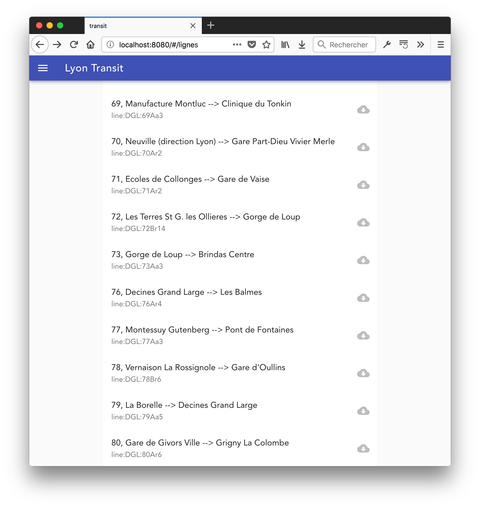

## TP 6 : Stockage local

Nous allons continuer le TP précédent et mettre en cache, c'est à dire stocker localement dans le navigateur, des données pour éviter leur rechargement. 


### Utilisation de l’API de Navitia

Voir la [première partie du TP précédent](../TP5/).

### Requêtage des horaires des lignes de métro/bus.

Nous allons implémenter plusieurs requêtes vers l'API de navitia et créer des composants associés. 

##### Récupération des lignes de TCL

Une requête GET sur le end-point suivant de l'API permet de récupérer la liste des lignes TCL : `https://api.navitia.io/v1/coverage/fr-se/networks/network:tcl/lines?` Attention, les résultats sont paginés, il y a 154 lignes opérées par TCL.

Le paramètre `start_page` permet de demander la page souhaitée.

Suivez ce [lien](http://canaltp.github.io/navitia-playground/play.html?request=https%3A%2F%2Fapi.navitia.io%2Fv1%2Fcoverage%2Ffr-se%2Fnetworks%2Fnetwork%253Atcl%2Flines%3F) pour tester l'API dans le bac à sable de Navitia.

Explorez l'objet JSON retourné, notamment la liste de ligne. Pour chaque ligne on s'intéressera aux clés `code`,  `name`, et `id`.

Construisez un module de store dédié aux informations sur les lignes sur le modèle du TP précédent.

##### Affichage de la liste des lignes

Créer un composant `Lignes` (et ses enfants) qui affiche la liste de lignes. Utiliser Vuetify pour cela. Suivez le même principe que l'affichage des résultats du TP précédent.

Vous pouvez ajouter à la `v-list` vuetify un boutton `v-list-tile-action` (voir la [doc](https://vuetifyjs.com/en/components/lists#example-icon-two-lines-and-action))



##### Récupération des informations d'une ligne TCL

En cas de clic sur le bouton télécharger nous allons maintenant récupérer les horaires de la ligne, grace à son identifiant. La requête GET devrait avoir la forme suivante :

`https://api.navitia.io/v1/coverage/fr-se/lines/line:DGL:C9Aa9/route_schedules?from_datetime=20180722T120000&items_per_schedule=25`

Il semblerait qu'il soit nécessaire d'indiquer une date/heure et un nombre d'éléments à renvoyer. Prenez soit la date/heure actuelle, soit une suffisamment dans le futur (juillet).

La liste des arrêts est accessible via `route_schedules[0].table.rows`.  Rajouter un élément `stops` qui contiendra un Array de tous les arrêts de la ligne correspondante dans l'objet vuex qui stocke les lignes.

Utiliser l'extension Vuejs des developers tools de votre navigateur pour vérifier que votre store vuex est construit correctement


##### Sauvegarde des arrêts et horaires d'une ligne 

Nous allons utiliser l'API localStorage du navigateur pour stocker les arrêts et horaires d'une ligne.

Dans le store consacré au stockage des lignes, sauvegarder la ligne dans le localStorage du site au moment de son ajout dans le store. On utilisera `JSON.stringify` pour sérialiser l'objet JSON qui sera stocké :

```js
localStorage.setItem(objet.id, JSON.stringify(objet.stops))
```

##### Chargement du localStorage au chargement de l'application

Lors du chargement de l'application nous voulons maintenant charger les lignes stockées dans le localStorage. Créer un lifecycle hook `beforeCreate` qui chargera les données du localStorage dans l'application Vue :

```js
new Vue({
	el: '#app',
	store,
	beforeCreate() {
		this.$store.dispatch('loadLines');
	}
});
```

Dans le module dédié au stockage des lignes de votre store, rajouter une actions qui charge dans son `state` les données du localStorage.

```js
	actions: {
	...
		loadLines(state) {
			//TODO
		}
	...
	},
```

Parcourir le localStorage en filtrant les clés et charger celles dont l'id commence par `line:DGL`

### Rendu

À rendre pour le dimanche 27 mai à 23h59.

Penser à mettre à jour votre README, incluant à minima : les identifiants du binome (n° étudiant, nom, prénom), les instruction de build, les dépendances implicites (i.e. les choses installées en global), toute autre chose facilitant la compréhension du projet par le correcteur.

Créer une branche rendu-tp6, vous continuerez à travailler sur le master dans les TP à venir. Toute erreur sur la gestion des branches sera pénalisée.

Reporter le numéro Tomuss (pas de ‘p’ devant) de votre binome sur Tomuss

Reporter le lien vers votre dépôt git qui permette de le cloner facilement, au format suivant : forge.univ-lyon1.fr:idutilisateur/projet.git


### Barème

- README 
- Rendu **propre** via Tomuss et la branche rendu-tp6
- Structure de projet Vue et structure sur la forge propre (bon usage de .gitignore)
- npm run dev lance le projet sur une machine “vierge” (à défaut toutes les dépendances globales sont explicitées dans le README)
- Qualité de l’exécution (code propre, ESLint ne soulève pas d’erreurs, qualité d’usage de l’application)
- Travail réparti au sein du binome : push équitables sur la forge (nombre de commits, nombre de lignes, etc.)

- Tous les éléments sont des composants
- Les composants ont le bon niveau de responsabilité 
- Utilisation appropriée de Vuetify
- Requêtage sur navitia.io
  - autocomplete
  - journey
  - lignes
  - arrêts
- LocalStorage
  - enregistrement des arrêts
  - chargement des arrêts
- Bonne interaction entre le store vuex et localstorage