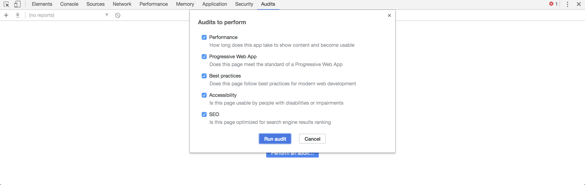
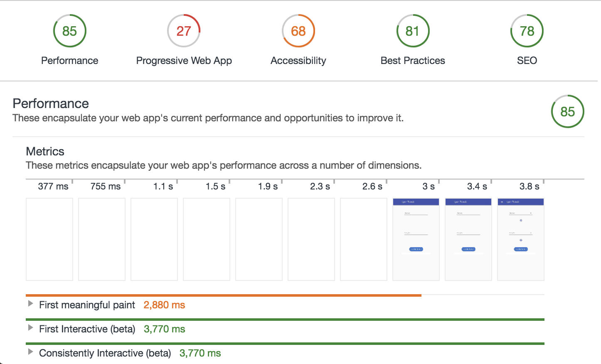

## TP 8 : Progressive Web apps


### Audit de l'application

Dans un premier temps charger votre application (idéalement une version déployée) dans Chrome et l'examiner avec l'outil d'audit [Lighthouse](https://developers.google.com/web/tools/lighthouse) disponible dans les outils de développement.



Voici un exemple de résultat attendu à ce stade du projet :




Nous allons maintenant traiter des problèmes signalés par LightHouse

### Chargements

- Vérifier que les chargements de polices de caractères et de css ne sont pas bloquants.

### App shell

La manière la plus propre de fournir un appshell efficace, est de faire une partie du rendu de l'application, i.e. la partie sans contenu, ni personalisation côté serveur (ce sera la même pour tout le monde). 1. Cela permet de ne faire le travail qu'une fois; 2. Le contenu peut être mis en cache côté serveur et transféré rapidement; 3. Il y a moins de calculs et de freins pour la première peinture côté client.

Pour des raisons de simplicité nous allons créer un appshell simple en éditant directement l' `index.html` de notre projet.

##### Preload

Permettez le téléchargement et le rendu asynchrone des polices et styles pour accélérer la première peinture. Si vous incluez des polices depuis votre index, chargez les avec `rel="prelaod"`, en suivant [ces indications](https://alligator.io/html/preload-prefetch/).

** Attention tester plutôt dans Chrome **

##### Bannière / menu

- Créer une banière temporaire directement dans le index.html
- Style la banière inline pour ne pas rajouter de dépendance

##### Feedback de chargement 

Afficher un spinner indiquant que le chargement est en cours.

##### Gestion de l'absence de JS

```html
<noscript>
  <h3 style="color: #673ab7; font-family: Helvetica; margin: 2rem;">
    Sorry, but app is not available without javascript
  </h3>
</noscript>
```

### Manifest

Nous allons maintenant rédiger un [Web App Manifest](https://developer.mozilla.org/en-US/docs/Web/Manifest). Voir l'[exemple de la MDN](https://developer.mozilla.org/en-US/docs/Web/Manifest) ou celui de [Google](https://developers.google.com/web/fundamentals/web-app-manifest/)

<!-- Tu pourrais aussi pointer la spec, stp : https://www.w3.org/TR/appmanifest/ ? -->

Vous pouvez utiliser ce [générateur d'icônes](https://romannurik.github.io/AndroidAssetStudio/icons-launcher.html) (mais de très nombreux autres sont disponibles).

Enfin inclure le manifest dans le head de votre `index` :

```html
<link rel="manifest" href="/manifest.json">
```

Dans les outils de développement de Chrome il est possible d'inspecter son manifest.


### Service Worker et Offline

Créer une page + route offline. On y affichera le trajet du T1 et ses horaires à Université Lyon 1.


### Rendu

À rendre pour le lundi 25 juin à 23h59.

Penser à mettre à jour votre README, incluant à minima : les identifiants du binome (n° étudiant, nom, prénom), les instruction de build, les dépendances implicites (i.e. les choses installées en global), toute autre chose facilitant la compréhension du projet par le correcteur.

Créer une branche rendu-tp8, même si ceci est le dernier rendu du cours. Toute erreur sur la gestion des branches sera pénalisée.

Reporter le numéro Tomuss (pas de ‘p’ devant) de votre binome sur Tomuss.

Reporter le lien vers votre dépôt git qui permette de le cloner facilement, au format suivant : `forge.univ-lyon1.fr:idutilisateur/projet.git`

La mise en place des PWA étant plus avancée dans Chrome,  **ce TP sera corrigé avec Chrome**. 

### Barême

- README 
- Rendu **propre** via Tomuss et la branche rendu-tp8
- Structure de projet Vue et structure sur la forge propre (bon usage de .gitignore)
- npm run dev lance le projet sur une machine “vierge” (à défaut toutes les dépendances globales sont explicitées dans le README)
- npm run build construit un projet dans le **dossier dist** prêt à être déployé (sera corrigé sur surge.sh)
- Qualité de l’exécution (code propre, ESLint ne soulève pas d’erreurs, qualité d’usage de l’application)
- Travail réparti au sein du binome : push équitables sur la forge (nombre de commits, nombre de lignes, etc.)
- Tous les éléments sont des composants
- Les composants ont le bon niveau de responsabilité 
- Utilisation appropriée de Vuetify

- Utiliser la position géographique pour recherche un trajet (3 pts)
- pseudo Réalité Augmenté (3 pts)
- Détection des capacités du dispositif (2pts)


### Références

- 
